# Architecture

## Signal flow

```mermaid
flowchart LR
    IN[Input] --> TRIM[Input Trim]
    TRIM --> GATE[Noise Gate]
    GATE --> SPLIT1[LR4 Split Low<br/>60-400 Hz, default 120 Hz]

    SPLIT1 -->|Low band| LCOMP[Parallel Compressor<br/>+ Makeup + Mix]
    LCOMP --> LLEVEL[Level]
    LLEVEL --> LALIGN[Phase-Align Allpass<br/>tied to Split High]

    SPLIT1 -->|Remainder| SPLIT2[LR4 Split High<br/>300-2000 Hz, default 600 Hz]

    SPLIT2 -->|Mid band| MDRIVE[Drive<br/>oversampled]
    MDRIVE --> MLEVEL[Level]

    SPLIT2 -->|High band| HTIGHT[Tight<br/>pre-drive HPF]
    HTIGHT --> HVOICE[Voicing:<br/>Gnaw / Wool / Razor<br/>4x oversampled]
    HVOICE --> HDRIVE[Drive]
    HDRIVE --> HTONE[Tone]
    HTONE --> HBLEND[Clean/Dist Blend]
    HBLEND --> HLEVEL[Level]

    MLEVEL --> MHSUM[Mid+High Sum]
    HLEVEL --> MHSUM
    MHSUM --> IR[IR Loader<br/>cab sim - Mid+High only]

    LALIGN --> SUM[Sum<br/>delay-compensated]
    IR --> SUM

    SUM --> EQ[4-band EQ]
    EQ --> CLIP[Safety Clip<br/>optional]
    CLIP --> OUT[Output Trim]
```



All three bands re-converge at the `Sum` stage. The Low band carries a compensation delay (matching the Mid/High branch's shared oversampling latency) and a phase-alignment allpass filter (see [Cascaded 3-band flat-sum](#cascaded-3-band-flat-sum-and-phase-alignment) below) so the three-way sum is both time-aligned and magnitude-flat.

## Module map

| Directory | Responsibility |
|---|---|
| `src/dsp` | All audio-thread DSP, each in its own class with a matching Catch2 test file: `Crossover` (LR4 split/sum, two cascaded instances - `lowSplit`, `midHighSplit`), `PhaseAlignFilter` (Low-band phase-alignment allpass - see below), `NoiseGateStage` (full-band input gate), `ParallelCompressor` (low-band dynamics), `MidBand` (mid-band staged drive, NEW in v0.2.0), `Voicing` (high-band Gnaw/Wool/Razor distortion + Tight pre-drive HPF + 4x oversampling + tone + blend), `BandEQ` (post-sum 4-band EQ), `IRLoader` (cab-sim convolution, relocated in v0.2.0 to the Mid+High branch), `SplitGap` (pure `clampSplitHighHz()` helper enforcing the minimum musical gap between the two crossover splits). `RealtimeCoefficients.h` is a shared helper for updating `juce::dsp::IIR` filter coefficients from the audio thread without heap allocation (see below). No allocation, locks, or I/O once `prepareToPlay` has run. |
| `src/params` | Parameter layout and `AudioProcessorValueTreeState` definitions — parameter IDs, ranges, defaults, and value-to-DSP mapping. Single source of truth for what a preset captures. |
| `src/presets` | M2 preset system (`PresetManager`, `PresetBar`, `Localisation`) - see [Preset system](#preset-system-m2) below. |
| `src/ui` | Editor/GUI code. Talks to the processor only through `src/params` (attachments) and read-only metering data — never reaches into `src/dsp` internals directly. Placeholder generic JUCE UI (plus the M2 preset bar) until the custom vector GUI lands in a later milestone (M3). |

Dependency direction is one-way: `src/ui` → `src/params` ← `src/presets`, and `src/dsp` is driven by `src/params` values but has no upward dependency on UI, presets, or state code. This keeps the DSP core testable in isolation (see `tests/`) without instantiating any UI or persistence machinery.

## Cascaded 3-band flat-sum and phase alignment

v0.2.0 restructures the signal path from a single 2-band LR4 split to two **cascaded** LR4 splits (Low, then Mid/High of the remainder) - see `docs/design-brief.md`'s Topology section for the design rationale. A single `cryp::Crossover`'s own dual-output Low+High sum is exactly a flat-magnitude allpass-filtered version of *that stage's own input* (`juce::dsp::LinkwitzRileyFilter`'s documented property). But naively cascading two such stages does **not** automatically make the three-way sum flat relative to the *original* input - confirmed empirically while building `tests/ThreeBandFlatSumTests.cpp`: deviations up to −10 dB appeared at close `splitLowHz`/`splitHighHz` ratios (worst inside the first crossover's own transition band), because the second crossover's own phase shift is applied only to the Mid+High branch, leaving the untouched Low band "out of phase" with it at the final sum.

The fix (`src/dsp/PhaseAlignFilter.h`) is proven algebraically, not just empirically: reading JUCE 8.0.14's own `juce_LinkwitzRileyFilter.cpp` source confirms the dual-output `processSample(channel, input, outputLow, outputHigh)`'s `outputLow + outputHigh` sum uses the *exact same formula* (built only from the first internal biquad stage's state) as that same class's single-output `processSample(channel, input)` in `Type::allpass` mode. Since that allpass transform is linear:

```
Low_compensated + Mid + High
  = Allpass2(Low) + Allpass2(Remainder)   [Mid+High = Allpass2(Remainder), by midHighSplit's own reconstruction property]
  = Allpass2(Low + Remainder)             [Allpass2 is linear]
  = Allpass2(Input)                       [Low + Remainder = Input exactly, lowSplit's own reconstruction property]
```

and `Allpass2(Input)` has flat magnitude relative to `Input` by definition (an allpass filter's magnitude response is unity at every frequency). `PhaseAlignFilter` wraps a *second, physically separate* `juce::dsp::LinkwitzRileyFilter<float>` instance configured `Type::allpass`, always tied to the *same* effective cutoff as `midHighSplit` (via `cryp::clampSplitHighHz()` - see below), applied to the Low band right after its own compressor+level processing, before the final sum. This is a standard technique in professional N-way active-crossover design (phase-alignment allpass networks between cascaded crossover stages), not a Crypta-specific invention.

## Minimum-gap clamp between Split Low and Split High

`splitLowHz`'s own range (60-400 Hz) overlaps `splitHighHz`'s own range (300-2000 Hz), so the two parameters could in principle collapse the Mid band to a degenerate near-zero (or inverted) width. `src/dsp/SplitGap.h`'s `cryp::clampSplitHighHz(splitLowHz, requestedSplitHighHz)` is a pure, real-time-safe function enforcing a minimum 1/3-octave gap: `midHighSplit` (and `lowBandPhaseAlign`, which must always match it exactly) are always set to `clampSplitHighHz()`'s *effective* value, never the raw `splitHighHz` parameter directly. `PluginProcessor`, the test suite, and the two DSP-level tests exercise the same function, so the boundary behaviour is directly testable (`tests/SplitGapTests.cpp`, `tests/ThreeBandFlatSumTests.cpp`).

## Real-time-safe filter coefficient updates

`juce::dsp::IIR::Coefficients<float>::makeLowShelf`/`makePeakFilter`/`makeHighShelf`/... (the usual way to build filter coefficients) heap-allocate a new `Coefficients` object on every call - fine in `prepareToPlay()`, not fine on the audio thread when a parameter (an EQ band's frequency, the high-band voicing's mid-filter, its tone or Tight control, ...) is being automated continuously. `BandEQ` and `Voicing` both use `juce::dsp::IIR::ArrayCoefficients<float>::makeXxx()` instead, which returns the same coefficients as a stack-only `std::array` (zero allocation), and `src/dsp/RealtimeCoefficients.h` writes that array's values directly into an already-allocated `Coefficients<float>` object's raw storage (normalising by `a0` the same way `Coefficients`' own constructor does). The `Coefficients` object itself is allocated exactly once, during `prepare()`; every subsequent update on the audio thread only ever overwrites existing memory.

## IR loader safe-by-default behaviour and relocation

`juce::dsp::Convolution` falls back to an internal single-sample identity impulse response when `loadImpulseResponse()` has never been called - but that fallback's assumed source sample rate is hardcoded to JUCE's `ProcessSpec` default (44100 Hz), so at any *other* session sample rate it would otherwise get silently resampled (smeared/attenuated) against a mismatched rate. `IRLoader::prepare()` closes that gap by explicitly loading a correctly-rate-tagged identity impulse response itself, so "no IR loaded" is a guaranteed bit-exact passthrough at every session sample rate, not only at 44100 Hz - see the class-level comment in `src/dsp/IRLoader.h`. This behaviour is unchanged in v0.2.0; what changed is *where* `IRLoader` sits in the signal path - it now processes only the Mid+High post-sum signal, structurally never the Low band (see `PluginProcessor.cpp`'s `processChunk()` and `tests/LowBandIsolationTests.cpp`, which asserts the Low band's own isolated output is bit-exact identical whether the IR loader is enabled or not).

## Latency compensation

The Mid band's staged drive (`cryp::MidBand`) and the High band's voicing (`cryp::Voicing`) each run their own nonlinear shaping stage oversampled 4x (`juce::dsp::Oversampling`, FIR half-band equiripple, max quality, integer latency) - two *physically separate* `juce::dsp::Oversampling` instances, identically configured (same factor exponent, same filter type), so their reported latencies are guaranteed numerically equal by construction even though they are not literally one shared object (see `src/dsp/MidBand.h`'s class docs for why literal instance-sharing was not implemented). This oversampling is the *only* source of latency in the current signal path - the gate, both crossovers, the phase-alignment allpass, the low-band parallel compressor, the EQ, and the IR loader (configured for zero-latency convolution) are all zero-latency by construction. To keep all three bands phase-coherent at the `Sum` stage:

- The Low band path carries a matching `juce::dsp::DelayLine` (integer/no-interpolation, since the delay is always a whole number of samples) sized to `juce::jmax(midBand.getLatencySamples(), highVoicing.getLatencySamples())`.
- The High band's own clean/distorted blend (`highBlend`) is handled by a `juce::dsp::DryWetMixer` whose dry path is *also* delay-compensated (`setWetLatency`) by that same amount, so the clean and distorted high-band signals stay phase-coherent with each other too, not just with the Low band. The Mid band has no blend control (see `src/dsp/MidBand.h`), so it needs no such compensation.

`CryptaAudioProcessor::computeTotalLatencySamples()` reports that shared value to the host via `setLatencySamples()`, so host-side plugin delay compensation (PDC) accounts for the whole chain.

### The `DryWetMixer` priming gotcha (JUCE 8.0.14)

`juce::dsp::DryWetMixer::prepare()` calls `reset()` internally, which snaps its smoothed dry/wet volumes to whatever `mix` was set to *at that moment* - so if `prepare()` runs before the real mix value is set, the mixer briefly snaps to a stale default before the next `setWetMixProportion()` call retargets it, causing an audible fade-in glitch on the very first block. `ParallelCompressor::prepare()`, `Voicing::prepare()`, and `IRLoader::prepare()` all take the current mix proportion as an explicit parameter and call `setWetMixProportion()` *before* `prepare()` internally, closing this gap at the API level rather than relying on call-order discipline at every call site. `MidBand` has no `DryWetMixer` (no blend control), so this gotcha does not apply to it.

## Preset system (M2)

v0.2.0 adds the suite-wide M2 preset system (`.scaffold/specs/preset-system-m2.md`), copied from `basilica-audio/nave`'s pilot implementation (`docs/preset-system-notes.md` in that repo is the replication recipe) - `src/presets/PresetManager.{h,cpp}` and `src/presets/PresetBar.{h,cpp}` are portable, Crypta-agnostic classes; the only Crypta-specific glue is `PluginProcessor.cpp`'s `makePresetManagerConfig()`/`makeFactoryPresetAssets()` helpers and the nine `presets/factory/*.json` files (embedded via `juce_add_binary_data` as `CryptaBinaryData`, see `CMakeLists.txt`). `AudioProcessorValueTreeState` is the single source of truth for parameter values; `PresetManager` reads/writes it only through its public API and owns no parallel copy of state.

`PresetManager`'s only audio-thread-adjacent code is its `AudioProcessorValueTreeState::Listener::parameterChanged()` override (dirty-flag tracking), implemented as a single lock-free `std::atomic<bool>` store. Every other method (file I/O, JSON parsing, `juce::String`/`juce::var` allocation) is message-thread-only, called from the processor's constructor or from `PresetBar`'s UI callbacks - never from `processBlock()`.

The editor (`PluginEditor.cpp`) installs a German localisation frame (`resources/i18n/de.txt`, selected via `SystemStats::getUserLanguage()`) before constructing `PresetBar`, using the same `initLocalisationThenGetPresetManager()` helper-function pattern nave established (member initialisers run in declaration order regardless of the order they're written in the initialiser list, so the helper must be invoked from `presetBar`'s own initialiser expression, not the constructor body).

## State migration (v0.1.x → v0.2.0)

`CryptaAudioProcessor::setStateInformation()` runs a one-way, best-effort migration (`migrateLegacySingleCrossover()`, `PluginProcessor.cpp`) before handing state to `apvts.replaceState()`: a v0.1.x session's single `crossoverFreq` `PARAM` XML element (that parameter ID no longer exists in v0.2.0's `ParameterLayout`) is read directly out of the raw XML, clamped into `splitHighHz`'s new 300-2000 Hz range, and injected as a new `splitHighHz` `PARAM` element - unless one is already present (defensive, not expected from a genuine v1 or v2 session). Every other new v0.2.0 parameter (`splitLowHz`, `midDrive`, `midLevel`, `highTightHz`) simply falls back to its own `ParameterLayout` default via `AudioProcessorValueTreeState::replaceState()`'s existing "unmentioned parameter ID keeps its current/default value" behaviour - no special-case code needed for those. See `tests/StateMigrationTests.cpp` for the full test coverage, including the dedicated regression test asserting an untouched v0.1.x session (shipped default `crossoverFreq` = 250 Hz, below the new 300 Hz floor) lands exactly at 300 Hz.
