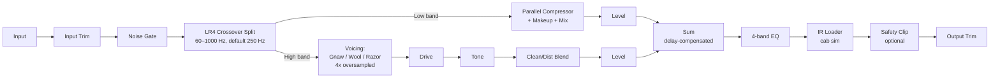

# Architecture

## Signal flow

Both bands re-converge at the `Sum` stage. The low band carries a compensation delay so it stays time-aligned with the oversampled high band (see [Latency compensation](#latency-compensation) below).

## Module map

| Directory | Responsibility |
|---|---|
| `src/dsp` | All audio-thread DSP, each in its own class with a matching Catch2 test file: `Crossover` (LR4 split/sum), `NoiseGateStage` (full-band input gate), `ParallelCompressor` (low-band dynamics), `Voicing` (high-band Gnaw/Wool/Razor distortion + 4x oversampling + tone + blend), `BandEQ` (post-sum 4-band EQ), `IRLoader` (cab-sim convolution). `RealtimeCoefficients.h` is a shared helper for updating `juce::dsp::IIR` filter coefficients from the audio thread without heap allocation (see below). No allocation, locks, or I/O once `prepareToPlay` has run. |
| `src/params` | Parameter layout and `AudioProcessorValueTreeState` definitions — parameter IDs, ranges, defaults, and value-to-DSP mapping. Single source of truth for what a preset captures. |
| `src/state` | Plugin state serialization: preset save/load, versioned state migration, `getStateInformation`/`setStateInformation` glue. Depends on `src/params` for what to persist, not on `src/dsp` directly. Not yet built out beyond the base APVTS state save/load already wired in `PluginProcessor` - the dedicated preset manager/versioning scheme is a later milestone. |
| `src/ui` | Editor/GUI code. Talks to the processor only through `src/params` (attachments) and read-only metering data — never reaches into `src/dsp` internals directly. Placeholder generic JUCE UI until the custom vector GUI lands in a later milestone. |

Dependency direction is one-way: `src/ui` → `src/params` ← `src/state`, and `src/dsp` is driven by `src/params` values but has no upward dependency on UI or state code. This keeps the DSP core testable in isolation (see `tests/`) without instantiating any UI or persistence machinery.

## Real-time-safe filter coefficient updates

`juce::dsp::IIR::Coefficients<float>::makeLowShelf`/`makePeakFilter`/`makeHighShelf`/... (the usual way to build filter coefficients) heap-allocate a new `Coefficients` object on every call - fine in `prepareToPlay()`, not fine on the audio thread when a parameter (an EQ band's frequency, the high-band voicing's mid-filter, its tone control, ...) is being automated continuously. `BandEQ` and `Voicing` both use `juce::dsp::IIR::ArrayCoefficients<float>::makeXxx()` instead, which returns the same coefficients as a stack-only `std::array` (zero allocation), and `src/dsp/RealtimeCoefficients.h` writes that array's values directly into an already-allocated `Coefficients<float>` object's raw storage (normalising by `a0` the same way `Coefficients`' own constructor does). The `Coefficients` object itself is allocated exactly once, during `prepare()`; every subsequent update on the audio thread only ever overwrites existing memory.

## IR loader safe-by-default behaviour

`juce::dsp::Convolution` falls back to an internal single-sample identity impulse response when `loadImpulseResponse()` has never been called - but that fallback's assumed source sample rate is hardcoded to JUCE's `ProcessSpec` default (44100 Hz), so at any *other* session sample rate it would otherwise get silently resampled (smeared/attenuated) against a mismatched rate. `IRLoader::prepare()` closes that gap by explicitly loading a correctly-rate-tagged identity impulse response itself, so "no IR loaded" is a guaranteed bit-exact passthrough at every session sample rate, not only at 44100 Hz - see the class-level comment in `src/dsp/IRLoader.h`.

## Latency compensation

The high band's voicing stage (`tyg::Voicing`) runs its nonlinear waveshaping oversampled 4x (`juce::dsp::Oversampling`, FIR half-band equiripple, max quality, integer latency), which introduces processing latency that the low band does not incur. This is the *only* source of latency in the current signal path - the gate, low-band parallel compressor, EQ, and IR loader (configured for zero-latency convolution) are all zero-latency by construction. To keep the two bands phase-coherent at the `Sum` stage:

- The low band path carries a matching `juce::dsp::DelayLine` (integer/no-interpolation, since the delay is always a whole number of samples) sized to the high band's oversampling latency.
- The high band's own clean/distorted blend (`highBlend`) is handled by a `juce::dsp::DryWetMixer` whose dry path is *also* delay-compensated (`setWetLatency`) by that same amount, so the clean and distorted high-band signals stay phase-coherent with each other too, not just with the low band.

`TwistYourGutsAudioProcessor::computeTotalLatencySamples()` reports `Voicing::getLatencySamples()` to the host via `setLatencySamples()`, so host-side plugin delay compensation (PDC) accounts for the whole chain. If the DSP later adds another latency source (e.g. a different oversampling factor becomes user-selectable), this seam is where it gets folded in.

### The `DryWetMixer` priming gotcha (JUCE 8.0.14)

`juce::dsp::DryWetMixer::prepare()` calls `reset()` internally, which snaps its smoothed dry/wet volumes to whatever `mix` was set to *at that moment* - so if `prepare()` runs before the real mix value is set, the mixer briefly snaps to a stale default before the next `setWetMixProportion()` call retargets it, causing an audible fade-in glitch on the very first block. `ParallelCompressor::prepare()`, `Voicing::prepare()`, and `IRLoader::prepare()` all take the current mix proportion as an explicit parameter and call `setWetMixProportion()` *before* `prepare()` internally, closing this gap at the API level rather than relying on call-order discipline at every call site.
